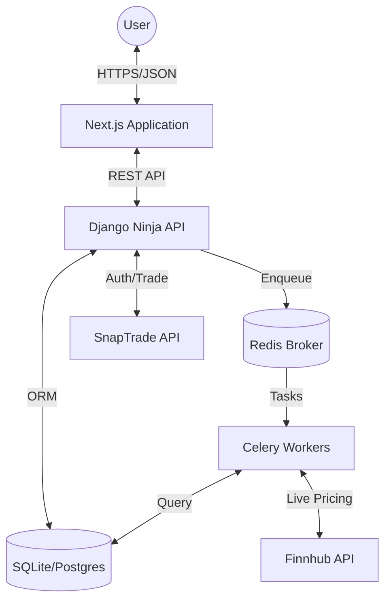
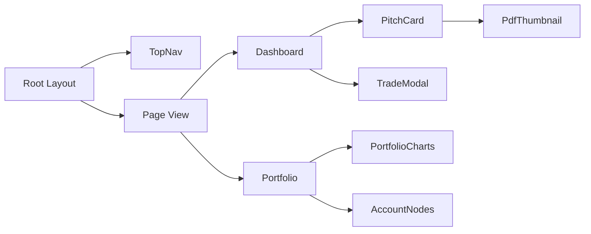

# VSPP — Virtual Stock Pitch Platform (Bought or Not)

VSPP is a high-performance, tactical stock pitching and portfolio tracking environment designed for institutional-grade visual clarity and split-second decision making. It bridges the gap between static stock slidedecks and live brokerage execution.

## ⚡ Key Features

### 📡 Tactical Dashboard
- **Feed System**: Real-time stream of verified stock pitches from global analysts.
- **Dual-Action Protocol**:
    - **Invest**: Instant transition to the Trade Terminal for execution.
    - **Clear**: Dismiss pitches from view (persisted via `localStorage`) with a global "Restore" override.
- **Alpha Tracking**: Live performance benchmarking against the SPY (S&P 500) using Finnhub integration.
- **Visual PDFs**: First-slide preview system for all attached slidedecks with instantaneous download capability.

### 📊 Intelligence Center (Portfolio)
- **Live Sync**: Direct integration with primary brokerage accounts via SnapTrade API.
- **Animated Analytics**: Performance visualizations powered by Recharts and Framer Motion:
    - **Performance Timeline**: 30-day portfolio value trajectory.
    - **Asset Distribution**: Donut breakdown of holdings + liquid reserves.
    - **P&L Breakdown**: Granular unrealized gain/loss mapping per instrument.
- **Quantum Trade Terminal**: Multi-step order execution with quantity selection and real-time impact evaluation.

---

## 🏗️ System Design & Architecture

VSPP uses a modern decoupled architecture designed for high availability and low latency during market hours.

### 🔄 Data Flow Architecture


### 🛰️ Component Hierarchy


### 🛠️ Tech Stack
- **Frontend**: 
  - `Next.js 16+` (App Router)
  - `Framer Motion` (High-octane animations)
  - `Recharts` (Tactical data visualization)
  - `Lucide` (Iconography)
  - `Tailwind CSS` (Cyber-dark design system)
- **Backend**:
  - `Python 3.12+`
  - `Django 6.0` (Core infrastructure)
  - `Django Ninja` (High-speed REST endpoints)
  - `Celery` + `Redis` (Asynchronous task processing)
- **Data & APIs**:
  - `SnapTrade` (Unified brokerage aggregation)
  - `Finnhub` (Real-time market pricing & SPY benchmarking)

---

## 🚦 Getting Started

### Prerequisites
- Python 3.12+
- Node.js 18+
- Redis (for Celery tasks)

### Backend Configuration
1. Create a virtual environment: `python -m venv venv`
2. Install dependencies: `pip install -r requirements.txt`
3. Configure `.env` with SnapTrade and Finnhub keys.
4. Run migrations: `python manage.py migrate`
5. Start the server: `python manage.py runserver`

### Frontend Configuration
1. Navigate to `frontend/`
2. Install packages: `npm install`
3. Launch development node: `npm run dev`

### Protocol Background Tasks
Initialize the intelligence workers for alpha tracking:
```bash
# Terminal 1: Core Worker
celery -A vspp worker -l info

# Terminal 2: Periodic Scheduler
celery -A vspp beat -l info
```

---

## 🛡️ Security Protocol
- **Brokerage Isolation**: Trading is handled via SnapTrade's secure connection portal. No credentials touch VSPP servers.
- **Session Management**: Secure HttpOnly cookies with CSRF protection.
